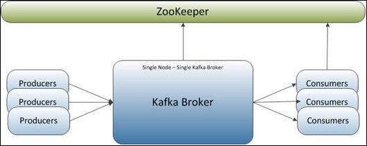

# Example Kafka

+ See [producer configuration](http://kafka.apache.org/documentation.html#producerconfigs)
+ See https://github.com/mapr-demos/kafka-sample-programs
+ See [Nexus](https://repository.sonatype.org/) for class/maven package relations
+ See [Companies using Kafka](https://cwiki.apache.org/confluence/display/KAFKA/Powered+By)
+ See [Kafka manager](https://github.com/yahoo/kafka-manager)
+ See [Comparison kafka vs RabbitMQ](https://www.quora.com/What-are-the-differences-between-Apache-Kafka-and-RabbitMQ)
+ See [Unit testing](https://github.com/charithe/kafka-junit)
+ See [Example](https://www.mapr.com/blog/getting-started-sample-programs-apache-kafka-09)

## Release
Create a new release
+ make sure code is ok
+ checkin all code
+ ``` mvn clean release:clean ``` to make sure no garbage exists before building a release
+ ``` mvn release:prepare ```

To be able to use git with scm add server identification to setting.xml with username / password.

```
<settings xmlns="http://maven.apache.org/SETTINGS/1.0.0"
      xmlns:xsi="http://www.w3.org/2001/XMLSchema-instance"
      xsi:schemaLocation="http://maven.apache.org/SETTINGS/1.0.0
                          https://maven.apache.org/xsd/settings-1.0.0.xsd">
<servers>
  <server>
    <id>github.com</id>
    <username>user</username>
    <password>pwd</password>
  </server>
</servers>

</settings>
```
Note since in my pom.xml scm uses https the username must not contain the '@' sign. If it does it can be urlencoded to make sure the right username is used.


## Prerequisits
To start, you need to get Kafka up and running and create some topics.

### Step 1: Download Kafka
Download kafka, the latest version can be found on [apache kafka](http://kafka.apache.org/) the download link

After downloading, goto your destination directory 
 
```
$ tar xzvf ~/Downloads/kafka-0.10.0.0-src.tgz
$ cd kafka-0.10.0.0

```
### Step 2: Start the server
Starting a server means staring zookeeper and kafka!
This is the single broker cluster configuration



#### Step 2.1: Start zookeeper
Start a ZooKeeper server. Kafka has a single node Zookeeper configuration built-in.
```
$ bin/zookeeper-server-start.sh config/zookeeper.properties &
```
Note that this will start Zookeeper in the background. To stop
Zookeeper, you will need to bring it back to the foreground and use
control-C or you will need to find the process and kill it.

#### Step 2.2: Start kafka
Now start Kafka itself:
```
$ bin/kafka-server-start.sh config/server.properties &

```
As with Zookeeper, this runs the Kafka broker in the background. To
stop Kafka, you will need to bring it back to the foreground or find
the process and kill it explicitly using `kill`.

### Step 3: Create the topics for the test programs
We need one topic for the test program
```
$ bin/kafka-topics.sh --create --zookeeper localhost:2181 --replication-factor 1 --partitions 1 --topic my-topic
$ bin/kafka-topics.sh --create --zookeeper localhost:2181 --replication-factor 1 --partitions 4 --topic my-part-topic
```
These can be listed
```
$ bin/kafka-topics.sh --list --zookeeper localhost:2181
my-part-topic
my-topic
```
Or described
```
$ bin/kafka-topics.sh --describe --zookeeper localhost:2181 --topic my-topic
Topic:my-topic	PartitionCount:1	ReplicationFactor:1	Configs:
	Topic: my-topic	Partition: 0	Leader: 0	Replicas: 0	Isr: 0

$ bin/kafka-topics.sh --describe --zookeeper localhost:2181 --topic my-part-topic
Topic:my-topic	PartitionCount:4	ReplicationFactor:1	Configs:
	Topic: my-topic	Partition: 0	Leader: 0	Replicas: 0	Isr: 0
	Topic: my-topic	Partition: 1	Leader: 0	Replicas: 0	Isr: 0
	Topic: my-topic	Partition: 2	Leader: 0	Replicas: 0	Isr: 0
	Topic: my-topic	Partition: 3	Leader: 0	Replicas: 0	Isr: 0
```
Note that you will see log messages from the Kafka process when you
run Kafka commands. You can switch to a different window if these are
distracting.

The broker can be configured to auto-create new topics as they are mentioned, but that is often considered a bit 
dangerous because mis-spelling a topic name doesn't cause a failure.

## Ready for test
At this point, you should have a working Kafka broker running on your
machine. The next steps are to compile the example programs and play
around with the way that they work.

### Step 4: Compile and package up the example programs
Go back to the directory where you have the example programs and
compile and build the example programs.
```
$ cd ..
$ mvn test
...
```

## Cleaning Up
When you are done playing, stop Kafka and Zookeeper and delete the
data directories they were using from /tmp

```
$ fg
bin/kafka-server-start.sh config/server.properties
^C
$ fg
bin/zookeeper-server-start.sh config/zookeeper.properties
^C
$ rm -rf /tmp/zookeeper/  
$ rm -rf /tmp/kafka-logs/
$
```

